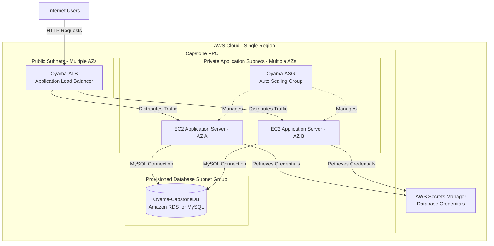

# AWS Capstone Project Architecture

## Architecture Diagram

The solution is deployed in one AWS Region using the provisioned Capstone VPC.

```mermaid
flowchart TB
    U[Internet Users]

    subgraph AWS[AWS Cloud - Single Region]
        subgraph VPC[Capstone VPC]

            subgraph PUBLIC[Public Subnets - Multiple AZs]
                ALB[Oyama-ALB<br/>Application Load Balancer]
            end

            subgraph PRIVATE[Private Application Subnets - Multiple AZs]
                ASG[Oyama-ASG<br/>Auto Scaling Group]
                EC2A[EC2 Application Server - AZ A]
                EC2B[EC2 Application Server - AZ B]
            end

            subgraph DATABASE[Provisioned Database Subnet Group]
                RDS[(Oyama-CapstoneDB<br/>Amazon RDS for MySQL)]
            end
        end

        SM[AWS Secrets Manager<br/>Database Credentials]
    end

    U -->|HTTP Requests| ALB
    ALB -->|Distributes Traffic| EC2A
    ALB -->|Distributes Traffic| EC2B
    ASG -.->|Manages| EC2A
    ASG -.->|Manages| EC2B
    EC2A -->|MySQL Connection| RDS
    EC2B -->|MySQL Connection| RDS
    EC2A -->|Retrieves Credentials| SM
    EC2B -->|Retrieves Credentials| SM

```
